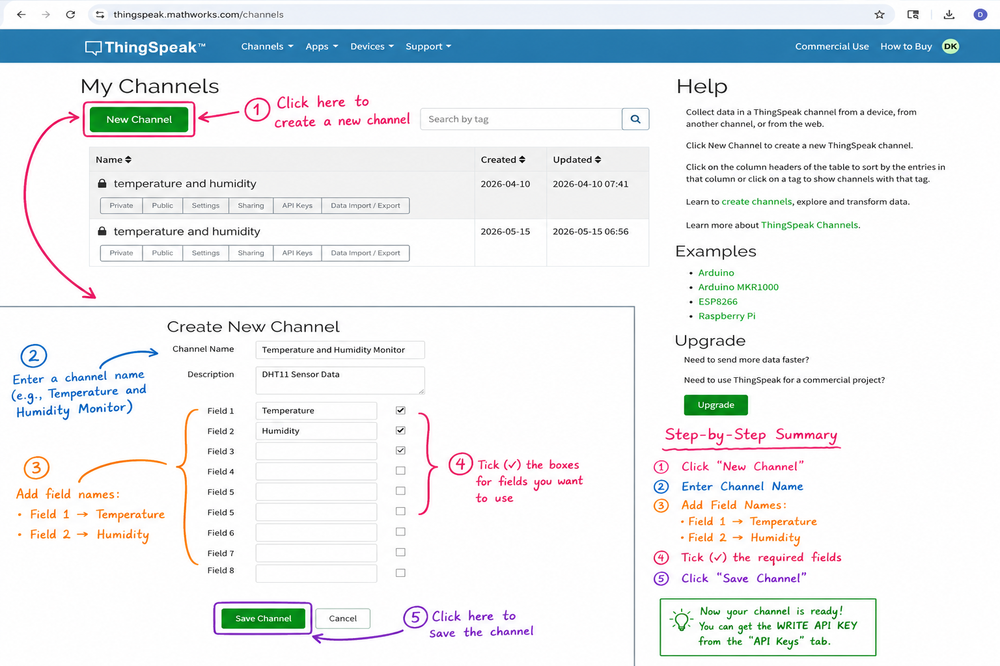
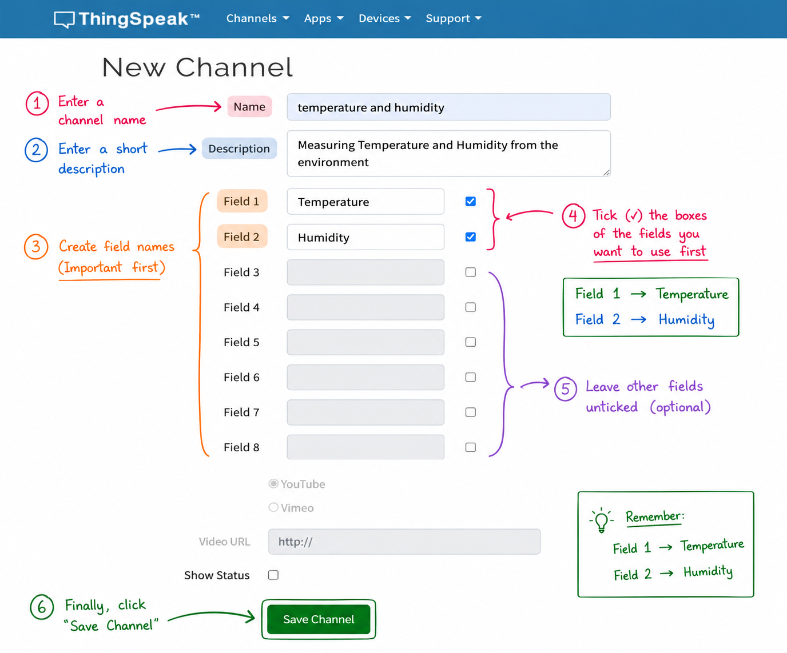
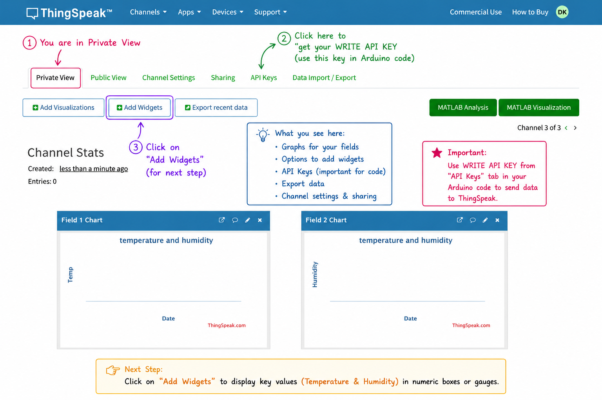
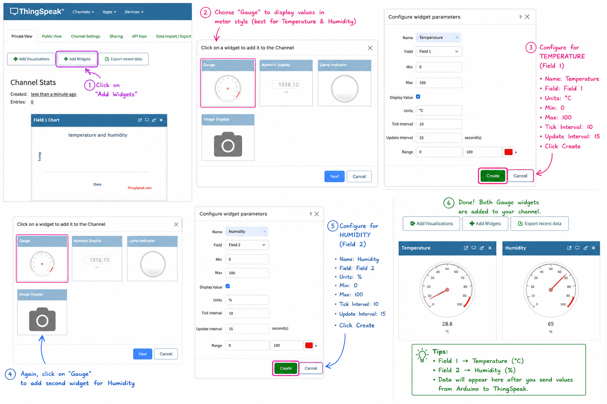
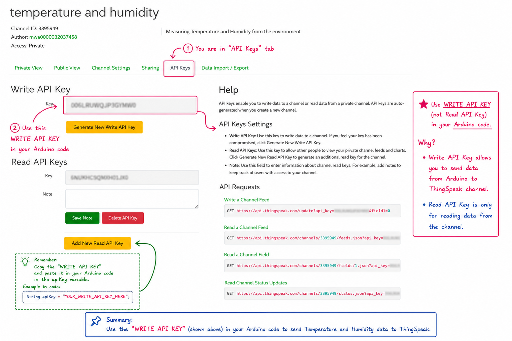

# EXP 06 Temperature notification using Arduino
## Aim

To measure **temperature** and **humidity** using a DHT11 sensor with Arduino, upload the readings to **ThingSpeak**, and display a notification when temperature or humidity exceeds preset threshold values.[^2][^1]

## Materials Required

- Arduino Uno R4 WiFi
- DHT11 temperature and humidity sensor
- Jumper wires
- Breadboard
- USB cable
- Computer with Arduino IDE
- Wi‑Fi connection
- ThingSpeak account and Write API key[^4][^2]


## Construction

**DHT11 Connection:**

- **VCC → 5V**
- **GND → GND**
- **Data Pin → Digital Pin 2**

**Wi‑Fi Connection:**

- The Arduino Uno R4 WiFi uses its built-in Wi‑Fi hardware with the `WiFiS3` library to connect to the wireless network.[^2]

**Circuit Layout:**
Use a breadboard and jumper wires to connect the DHT11 sensor neatly to the Arduino board.

## Source Code

```cpp
#include <WiFiS3.h>
#include <DHT.h>

// WiFi credentials
char ssid[] = "Your Wifi Name";
char pass[] = "Your Password";

// ThingSpeak
String apiKey = "VJTEU1ILB8V2RD34";
const char* server = "api.thingspeak.com";

// DHT setup
#define DHTPIN 2
#define DHTTYPE DHT11
DHT dht(DHTPIN, DHTTYPE);

WiFiClient client;

// Thresholds
float tempThreshold = 30.0;
float humThreshold = 70.0;

void setup() {
  Serial.begin(9600);
  dht.begin();

  Serial.print("Connecting to WiFi...");
  while (WiFi.begin(ssid, pass) != WL_CONNECTED) {
    Serial.print(".");
    delay(3000);
  }
  Serial.println("\nConnected to WiFi!");
}

void loop() {
  float temperature = dht.readTemperature();
  float humidity = dht.readHumidity();

  if (isnan(temperature) || isnan(humidity)) {
    Serial.println("Failed to read from DHT sensor!");
    return;
  }

  Serial.print("Temperature: ");
  Serial.print(temperature);
  Serial.print(" °C | Humidity: ");
  Serial.print(humidity);
  Serial.println(" %");

  if (client.connect(server, 80)) {
    String url = "/update?api_key=" + apiKey +
                 "&field1=" + String(temperature) +
                 "&field2=" + String(humidity);

    client.print(String("GET ") + url + " HTTP/1.1\r\n" +
                 "Host: " + server + "\r\n" +
                 "Connection: close\r\n\r\n");

    Serial.println("Data sent to ThingSpeak");
  }

  client.stop();

  if (temperature > tempThreshold) {
    Serial.println("High Temperature Alert!");
  }

  if (humidity > humThreshold) {
    Serial.println("High Humidity Alert!");
  }

  delay(20000);
}
```

ThingSpeak supports updating multiple fields in one request, and free ThingSpeak usage has a minimum message update interval of 15 seconds, so the `delay(20000)` in your program is appropriate.[^3][^1]

## How to Run

1. Connect the DHT11 sensor to Arduino as described in the construction section.
2. Open Arduino IDE and paste the given code into a new sketch.
3. Install the required DHT library if it is not already installed, then select the proper board and port.
4. Enter your Wi‑Fi name, Wi‑Fi password, and valid ThingSpeak Write API key in the code.
5. Upload the code and open the **Serial Monitor** at **9600 baud**.
6. Observe the temperature and humidity values, check whether data is sent to ThingSpeak, and monitor alert messages when readings exceed the threshold.[^4][^2]

````md
### ThingSpeak Channel Setup

#### Step 1: Create a New Channel
- Open ThingSpeak and click on **“New Channel”**.
- Enter the channel name and description.



---

#### Step 2: Add Field Names
- Tick the required fields first.
- Enter:
  - **Field 1 → Temperature**
  - **Field 2 → Humidity**
- Leave remaining fields empty.
- Click **“Save Channel”**.



---

#### Step 3: Open Private View and Add Widgets
- Open the created channel.
- Stay in **Private View**.
- Click on **“Add Widgets”** to create visualization widgets.



---

#### Step 4: Create Gauge Widgets
- Select the **Gauge** widget.
- Create one widget for:
  - **Temperature (Field 1)**
- Create another widget for:
  - **Humidity (Field 2)**



---

#### Step 5: Copy the Write API Key
- Open the **API Keys** tab.
- Copy the **WRITE API KEY**.
- Paste this key inside the Arduino code in:
```cpp
String apiKey = "YOUR_WRITE_API_KEY";
````

* The **Write API Key** is used to send sensor data from Arduino to ThingSpeak.



---

```
```


## Output

**Serial Monitor Example:**

```text
Connecting to WiFi.....
Connected to WiFi!
Temperature: 31.00 °C | Humidity: 72.00 %
Data sent to ThingSpeak
High Temperature Alert!
High Humidity Alert!
```

**ThingSpeak Output:**

- Field 1 stores **temperature** values.
- Field 2 stores **humidity** values.[^1][^4]


## Explanation of the Code

1. **Library Inclusion:**
`WiFiS3.h` is used for Wi‑Fi communication, and `DHT.h` is used to read the DHT11 sensor values.[^2]
2. **Wi‑Fi Connection:**
`WiFi.begin(ssid, pass)` repeatedly attempts to connect the Arduino board to the specified wireless network.
3. **Sensor Reading:**
`dht.readTemperature()` reads temperature in Celsius, and `dht.readHumidity()` reads relative humidity from the DHT11 sensor.[^2]
4. **Error Checking:**
`isnan()` checks whether the sensor reading failed before continuing further processing.[^2]
5. **Sending Data to ThingSpeak:**
The code connects to `api.thingspeak.com` and sends temperature and humidity values using `field1` and `field2` in the update request.[^1][^4]
6. **Notifications:**
If temperature becomes greater than 30°C, the program prints a high temperature alert. If humidity becomes greater than 70%, it prints a high humidity alert.
7. **Delay:**
A delay of 20 seconds is used, which is safely above ThingSpeak’s free update limit of 15 seconds.[^3]

## Viva Questions

1. **What sensor is used in this experiment?**
DHT11 is used to measure temperature and humidity.[^2]
2. **Which pin is used for the DHT11 data line?**
Digital pin 2.
3. **Why is `isnan()` used in the program?**
It checks whether the sensor returned an invalid reading.[^2]
4. **What is the purpose of ThingSpeak here?**
It stores and displays the sensor data online.[^4]
5. **Which fields are used in ThingSpeak?**
`field1` is used for temperature and `field2` is used for humidity.[^1]
6. **When is the high temperature alert shown?**
When the temperature is greater than 30°C.
7. **Why is a delay of 20 seconds used?**
Because ThingSpeak free service requires at least 15 seconds between updates.[^3]

## Observations

- The Arduino connects to Wi‑Fi and begins reading temperature and humidity from the DHT11 sensor.
- The measured values are displayed on the Serial Monitor and uploaded to ThingSpeak at regular intervals.
- Alert messages appear whenever temperature or humidity crosses the defined threshold values.[^3][^1][^2]


## Result

- Successfully measured temperature and humidity using the DHT11 sensor.
- Uploaded the readings to ThingSpeak and displayed notification messages when the readings exceeded the preset limits.[^1][^2]

I can also make this in the exact same formatting style as your earlier records, including the horizontal lines, bold labels, and cleaner observation/result wording.
<span style="display:none">[^10][^5][^6][^7][^8][^9]</span>

<div align="center">⁂</div>

[^1]: https://www.mathworks.com/matlabcentral/answers/728058-thingspeak-read-write-multiple-field

[^2]: https://dev.to/carolineee/a-simple-arduino-sketch-to-read-temperature-and-humidity-data-from-a-dht11-sensor-2l3d

[^3]: https://thingspeak.mathworks.com/pages/license_faq

[^4]: https://www.mathworks.com/help/simulink/supportpkg/arduino_ref/read-and-write-to-thingspeak-channel-using-arduino-wifi-http-client-block.html

[^5]: https://www.mathworks.com/matlabcentral/answers/403344-how-to-reduce-the-thingspeak-upload-delay

[^6]: https://www.instructables.com/How-to-Use-DHT11-Temperature-Sensor-With-Arduino-a/

[^7]: https://forum.arduino.cc/t/updating-more-than-one-field-in-thingspeak/547771

[^8]: https://www.instructables.com/DHT11-Temperature-and-Humidity-Sensor-With-Arduino/

[^9]: https://forum.arduino.cc/t/problem-with-update-frequency-to-thingspeak-site/674769

[^10]: https://www.mathworks.com/matlabcentral/discussions/thingspeak/838887-field-2-not-updating

