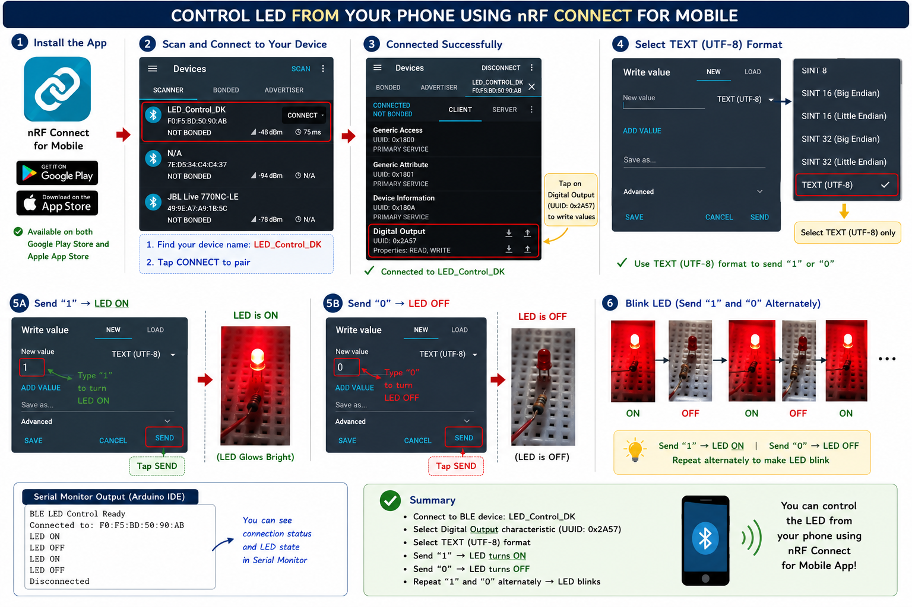

# EXP 02 Sense the available networks using Arduino
## IoT Lab – Experiment: BLE LED Control Using Arduino


***

## Aim

To use an **Arduino Uno R4 WiFi** (or Arduino board with BLE support) and the **ArduinoBLE** library to:

- Sense available **BLE (Bluetooth Low Energy)** networks
- Advertise a BLE service for **LED control**
- Control an **LED** (ON/OFF) by receiving data from a BLE central device

The LED turns **ON** when the received value is `"1"` and **OFF** when the received value is `"0"`.

***

## Materials Required

- Arduino Uno R4 WiFi (or Arduino board with built‑in BLE)
- LED
- Resistor (220Ω)
- Breadboard
- Jumper wires
- USB cable for Arduino
- Computer with Arduino IDE
- BLE-enabled device (smartphone or BLE controller) for testing

***

## Construction

**LED Connection:**

- Connect the **long leg (positive)** of the LED to **Digital Pin 13**.
- Connect the **short leg (negative)** to a **resistor (220Ω)**.
- Connect the other side of the resistor to **GND**.

**BLE Module:**

- The Arduino Uno R4 WiFi has **built-in BLE**, so no external BLE module is required.
- The BLE functionality is accessed using the `ArduinoBLE` library.

**Circuit Layout:**
Use a breadboard to connect the LED and resistor neatly to the Arduino board with jumper wires.

***

## Source Code

```cpp
#include <ArduinoBLE.h>

const int ledPin = 13;
BLEService ledService("12345678-1234-1234-1234-1234567890ab");

BLECharacteristic ledCharacteristic(
  "abcd1234-5678-1234-5678-1234567890ab",
  BLEWrite,
  1
);

void setup() {
  Serial.begin(9600);
  pinMode(ledPin, OUTPUT);

  if (!BLE.begin()) {
    Serial.println("Failed to start BLE!");
    while (1);
  }

  BLE.setLocalName("LED_Control_DK");
  BLE.setAdvertisedService(ledService);

  ledService.addCharacteristic(ledCharacteristic);
  BLE.addService(ledService);

  ledCharacteristic.writeValue((byte)0);

  BLE.advertise();
  Serial.println("BLE LED Control Ready");
}

void loop() {
  BLEDevice central = BLE.central();

  if (central) {
    Serial.print("Connected to: ");
    Serial.println(central.address());

    while (central.connected()) {

      if (ledCharacteristic.written()) {

        int length = ledCharacteristic.valueLength();
        const uint8_t* data = ledCharacteristic.value();

        if (length > 0) {

          if (data[0] == '1') {
            digitalWrite(ledPin, HIGH);
            Serial.println("LED ON");
          } 
          else if (data[0] == '0') {
            digitalWrite(ledPin, LOW);
            Serial.println("LED OFF");
          }

        }
      }
    }

    Serial.println("Disconnected");
  }
}
```


***

## How to Run

1. **Connect the Hardware:**
    - Connect the LED and resistor to **Digital Pin 13** and **GND** as described in the construction section.
    - Connect the Arduino to your computer using a **USB cable**.
2. **Open Arduino IDE:**
    - Launch the Arduino IDE on your computer.
    - Open a new sketch and paste the provided source code.
    - Install the **ArduinoBLE** library if it is not already installed (via **Sketch → Include Library → Manage Libraries → search “ArduinoBLE”**).
3. **Select Board and Port:**
    - Go to **Tools → Board → Arduino Uno R4 WiFi** (or your BLE-enabled board).
    - Go to **Tools → Port → COMx** (where your Arduino is connected).
4. **Upload the Code:**
    - Click the **Upload** button (→) in Arduino IDE.
    - Wait until the IDE shows **“Done uploading”**.
5. **Monitor the Output:**
    - Open the **Serial Monitor** (**Tools → Serial Monitor**).
    - Set the baud rate to **9600**.
    - Observe messages like **“BLE LED Control Ready”**, **“Connected to: …”**, **“LED ON”**, and **“LED OFF”**.
6. **Connect via BLE:**
    - On your smartphone or BLE controller, scan for BLE devices.
    - Look for a device named **“LED_Control_DK”**.
    - Connect to it and write `"1"` to turn the LED **ON**, and `"0"` to turn it **OFF**.


```md id="n9s5bt"
## BLE Mobile App Control Using nRF Connect

- Install **nRF Connect for Mobile** from:
  - Google Play Store
  - Apple App Store

- Open the app and scan for BLE devices.
- Find your BLE device name:
  - **LED_Control_DK**
- Tap on **CONNECT**.

- Open the **CLIENT** section.
- Select:
  - **Digital Output**
- Tap on the **Write / Upload icon**.

- In the write value window:
  - Strictly select:
    - **TEXT (UTF-8)** format

⚠️ Do not select SINT or UINT formats.

- Send:
  - `"1"` → LED ON
  - `"0"` → LED OFF

- Repeating `"1"` and `"0"` alternately will make the LED blink.



---
```

***

## Output

**Serial Monitor Example:**

```text
BLE LED Control Ready
Connected to: 00:11:22:33:44:55
LED ON
LED OFF
Disconnected
Connected to: 00:11:22:33:44:55
LED ON
Disconnected
```

**LED Behavior:**

- LED remains **OFF** initially.
- LED turns **ON** when the BLE central writes `"1"` to the characteristic.
- LED turns **OFF** when the BLE central writes `"0"` to the characteristic.
- Serial Monitor shows connection status and LED state changes in real-time.

***

## Explanation of the Code

1. **Library Inclusion:**
`#include <ArduinoBLE.h>` includes the BLE library used to interact with the board’s built-in BLE hardware.
2. **BLE Service and Characteristic:**
    - `ledService` is a custom BLE service with a unique UUID.
    - `ledCharacteristic` is a writable BLE characteristic that accepts 1 byte of data.
    - The central device writes `"1"` or `"0"` to this characteristic to control the LED.
3. **BLE Initialization:**
    - `BLE.begin()` starts the BLE stack.
    - `BLE.setLocalName("LED_Control_DK")` sets the visible device name.
    - `BLE.setAdvertisedService(ledService)` makes the service discoverable.
    - `BLE.advertise()` starts broadcasting the device so other BLE devices can find it.
4. **Connecting to a Central Device:**
    - `BLE.central()` waits for a BLE central device (like a phone) to connect.
    - `central.connected()` checks if the connection is still active.
5. **LED Control from BLE:**
    - `ledCharacteristic.written()` checks if new data has been written.
    - If the first byte is `'1'`, the LED is turned **ON**.
    - If the first byte is `'0'`, the LED is turned **OFF**.
6. **Serial Monitor:**
    - Prints connection status, BLE device address, and LED state for debugging and monitoring.

***

## Viva Questions

1. **What is the function of `BLE.begin()`?**
It initializes the BLE stack on the Arduino board.
2. **What is a BLE service?**
A BLE service is a collection of related characteristics that define a specific functionality, such as LED control.
3. **What is a BLE characteristic?**
A characteristic holds data that can be read, written, or notified between BLE devices.
4. **Which pin is used to control the LED?**
Digital Pin 13.
5. **How is the LED controlled via BLE?**
The central device writes `"1"` to turn the LED ON and `"0"` to turn it OFF.
6. **What is the purpose of `BLE.advertise()`?**
It starts advertising the BLE service so other devices can discover and connect to the Arduino.
7. **What happens if `BLE.begin()` fails?**
The program prints **“Failed to start BLE!”** and enters an infinite loop.

***

## Observations

- The Arduino board advertises itself as **“LED_Control_DK”** and can be detected by BLE-enabled devices.
- When a central device connects, the Serial Monitor shows the device address and connection status.
- Writing `"1"` turns the LED **ON**, and writing `"0"` turns it **OFF**.
- Disconnection is detected and printed on the Serial Monitor.

***

## Result

- Successfully sensed available BLE networks and advertised a BLE service using Arduino.
- Controlled the LED via BLE by writing `"1"` or `"0"` from a central device.
- LED responded as intended, turning ON and OFF based on the received BLE data.

